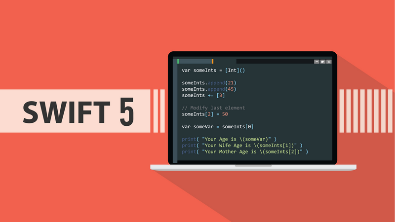

## Swift 30 Проектов / Rework by Azerzet

## Contents
This repo is updated with Swift 5 and compatible with iPhone X:

* Simple UIKit components
* UIScrollView, UITableView, UICollectionView
* CAAnimations and UIView Animations
* Local Notification in iOS 11
* MapKit, Contact, and Core ML frameworks
* Core Data, Today Extension, and 3D touch
* Popular Open Source Frameworks
* Design Patterns
* Test Driven Development, XCTest

## Developers ##

Twitter: [@guyindaozhang](https://twitter.com/guyindaozhang) 
Weibo: [@故胤道长](http://weibo.com/soapyigu)

